### 接口文档中心【apidoc-center】

-----------
#### 接入Lucene搜索版本

分支：br_lucene

接入Lucene，对项目、分组、接口建立索引，在用户搜索时根据输入的关键字给出最多3个搜索建议。

Q：IKAnalyzer jar包在本地Maven仓库不存在，如何安装IKAnalyzer到本地Maven仓库？

A：mvn install:install-file -Dfile=lib\ikanalyzer-2012_u6.jar -DgroupId=org.wltea -DartifactId=ikanalyzer -Dversion=2012_u6 -Dpackaging=jar
再将ikanalyzer-2012_u6-sources.jar复制到maven仓库对应的路径下。

-----------

一套适用于web的接口文档中心，主要功能：用户登录注册、项目管理、分组管理、接口管理、模拟调用，为企业内部维护接口文档提供便利。 使用jpa作为ORM框架连接MySQL数据库。 支持动态数据源、读写分离。建表语句在[create_tables.sql](src/main/resources/create_tables.sql)。

| 依赖项                       | 依赖版本           |
|---------------------------|----------------|
| Java                      | 11             |
| Spring Boot               | 2.7.6          |
| Thymeleaf                 | 3.0.15.RELEASE |
| Bootstrap                 | 4.6.2          |
| JQuery                    | 3.7.1          |
| MySQL                     | 5.7.44         |
| Spring Data JPA           | 2.7.6          |
| spring-boot-starter-redis | 1.4.0.RELEASE  |
| Lettuce                   | 6.1.10.RELEASE |

主要功能：
- 用户登录：包括用户名密码登录和OAuth2登录（GitHub、华为帐号登录）两种方式，用户名密码登录支持“记住我”。使用Spring Security框架做用户认证和权限控制。用户权限表user_authority中带有ADMIN权限的用户为系统管理员，拥有最大权限。登录成功后可以修改资料、上传头像。OAuth2登录后会要求绑定账号。
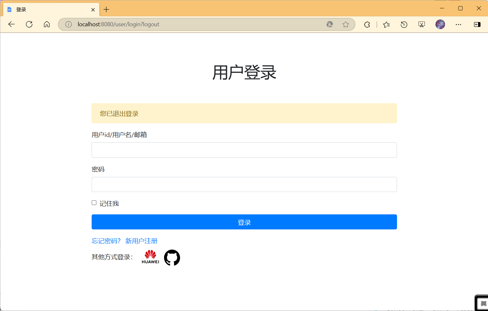
- 用户注册：需要填写有效邮箱并查收验证码完成注册
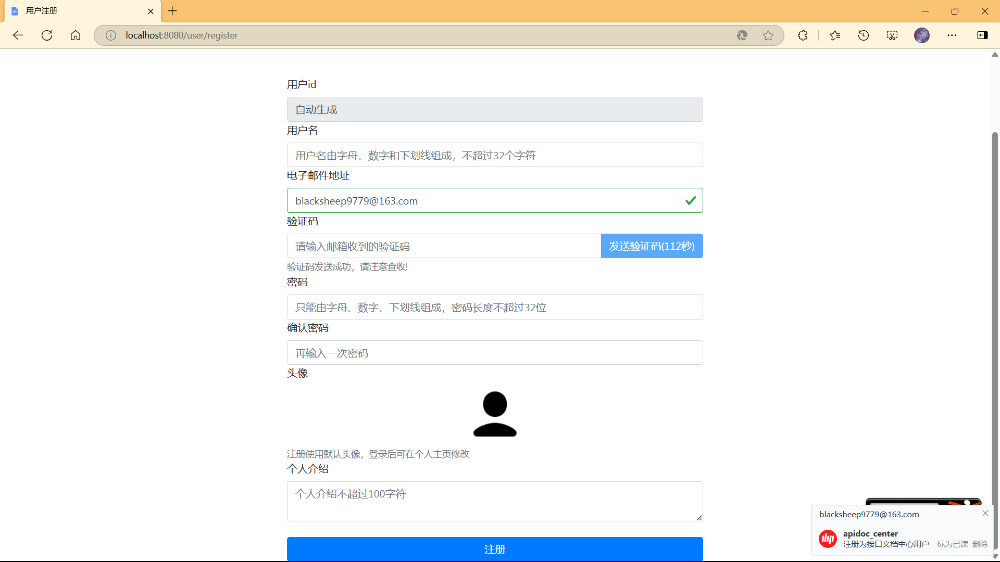
- 项目管理：创建项目、修改项目、删除项目。可指定项目各种环境（开发、测试、生产、自定义环境）的部署地址以供调用时选择。可指定公开或私有。可指定分享项目的用户名单。私有项目只能由项目创建者、系统管理员、分享用户查看。在所有项目页面按照创建时间降序排列。在我的关注页面中可查看关注的项目列表，关注功能使用Redis有序集合实现，按照关注时间降序排列。
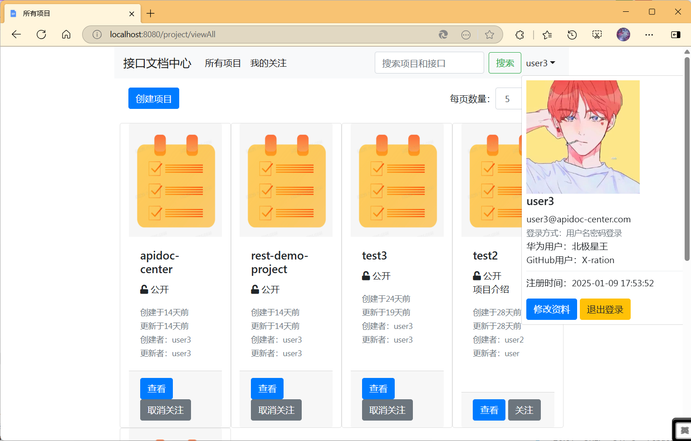
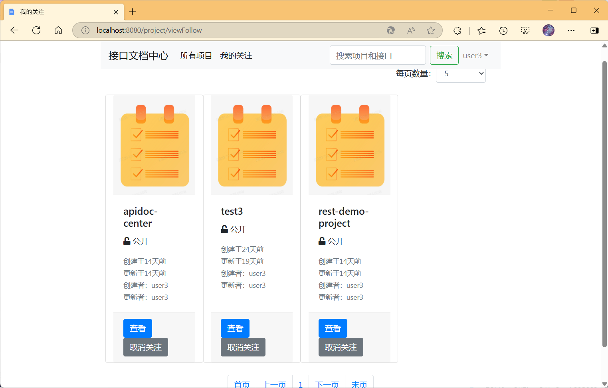
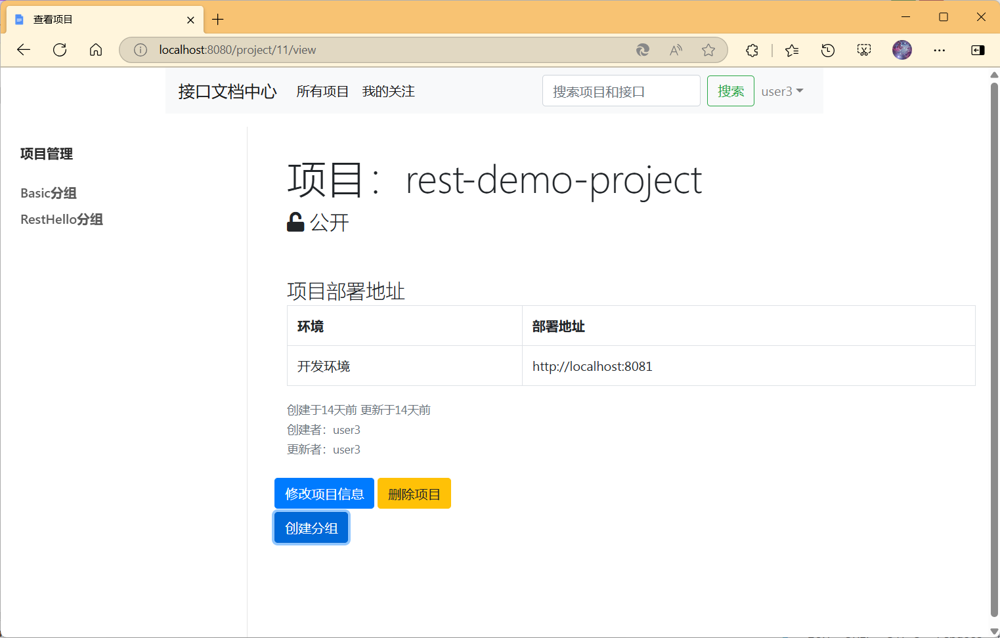
- 分组管理：创建分组、修改分组、删除分组。
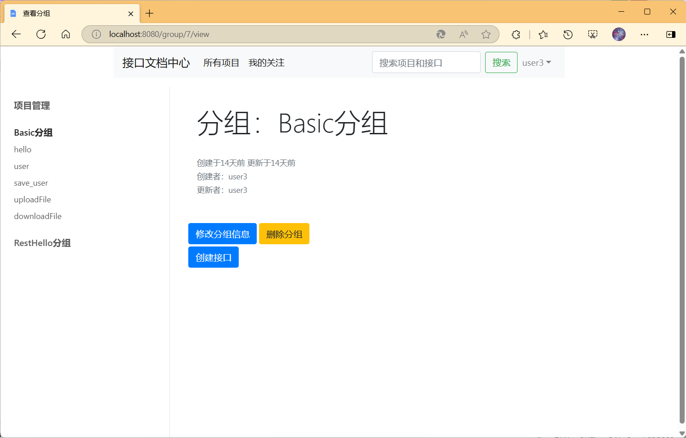
- 接口管理：创建接口、修改接口、删除接口。可指定接口相对路径、请求方法、请求体类型、响应体类型、头部参数列表、字段参数列表。允许的请求体类型包括：application/x-www-form-urlencoded、multipart/form-data、application/json、无请求体。允许的响应体类型包括：文本、文件。请求字段参数列表支持文件类型的参数（请求体类型需为multipart/form-data）。
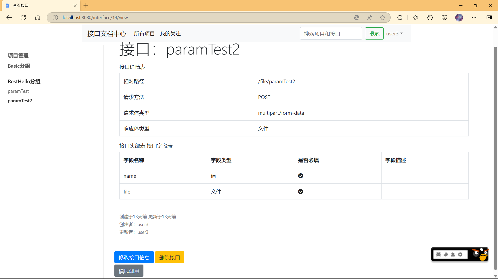
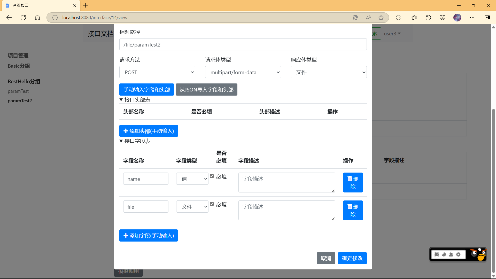
- 模拟调用：可以在接口详情页面进行接口调用，填写头部参数和字段参数后点击调用即可。原理是前端ajax+后端RestTemplate/Okhttp调用接口并返回给前端。支持响应体类型为文件的接口调用（即支持文件下载）。
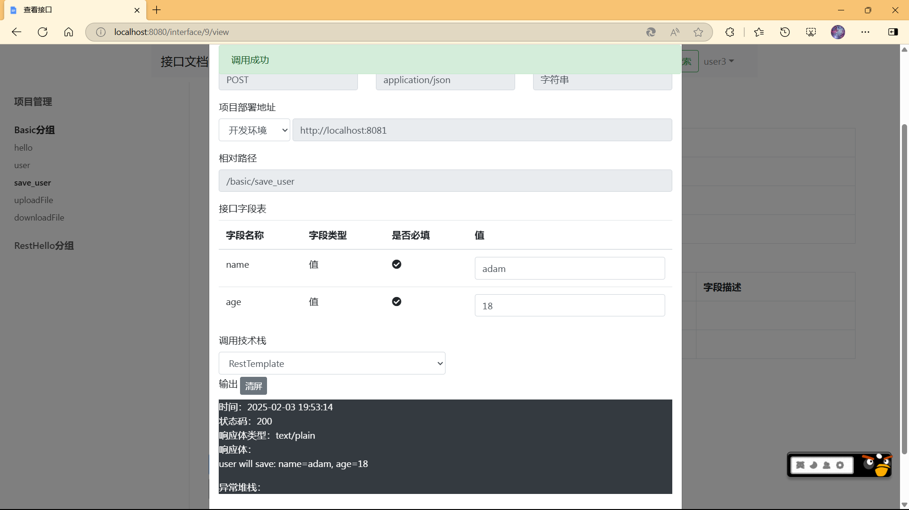
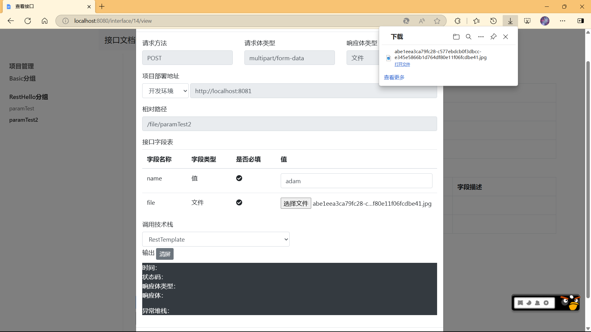
- 搜索：可以搜索项目、分组和接口，搜索是根据关键词对name/description属性进行模糊匹配得到的结果。支持所有类型或针对项目/分组/接口单独搜索。
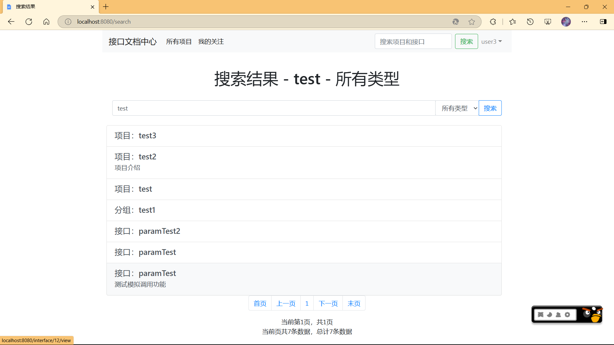

子模块rest-demo-project包含了不同类型的api接口以供测试。
- FileController.paramTest2方法可同时接收字符串和文件类型参数，返回值为文件类型
[FileController](rest-demo-project/src/main/java/com/adam/rest_demo_project/FileController.java)
- BasicController包含了可接受url参数、json参数的接口
[BasicController](rest-demo-project/src/main/java/com/adam/rest_demo_project/BasicController.java)